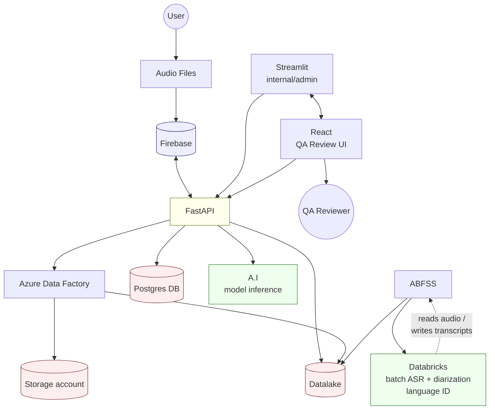

# Technical Architecture — High Level

> This document formalizes and extends the existing architecture sketch already in this repo (`documents/Agent sales call review.drawio` / `.pdf`). The stack below (Firebase, Azure Data Factory, Databricks, Postgres, FastAPI, React/Streamlit) is carried over from that diagram rather than reinvented, with the Hugging Face ASR/diarization/language-ID models from [Model Selection](05_model_selection_huggingface.md) slotted into the existing **A.I** and **Databricks** nodes.

## 1. Design Principles

- **Batch-first**: calls are processed in batches on cloud compute (Databricks GPU clusters), not in real time (per confirmed scope in [Project Overview](01_project_overview.md)).
- **Language-aware routing**: language identification happens before transcription so each call can be routed to the model best suited to it (see [Model Selection](05_model_selection_huggingface.md)).
- **Existing stack, not a rebuild**: reuses the storage/orchestration/UI components already sketched in `documents/Agent sales call review.drawio` instead of introducing a parallel set of generic components.
- **POPIA-aware by default**: access control and retention are first-class considerations, not an afterthought (see [Data Privacy & POPIA](07_data_privacy_popia.md)).

## 2. Components

| Component | Responsibility |
|---|---|
| **Firebase** | Initial landing point for uploaded call audio; storage + trigger for kicking off processing |
| **FastAPI** | Central backend — orchestration hub between Firebase, Azure Data Factory, Postgres DB, Datalake, and the A.I service; exposes the API consumed by React/Streamlit |
| **Azure Data Factory (ADF)** | Orchestrates movement of audio/derived data from Firebase into the Storage account and Datalake |
| **Storage account (Azure Blob)** | Durable raw audio storage |
| **Datalake (ADLS Gen2)** | Landing zone for raw + processed artifacts (normalized audio, transcripts, diarization output) read/written by Databricks via ABFSS and directly by FastAPI |
| **ABFSS** | Protocol Databricks uses to read/write the Datalake |
| **Databricks** | Batch compute layer — runs the language ID, ASR, and diarization jobs (the Hugging Face models from [Model Selection](05_model_selection_huggingface.md)) at scale over audio in the Datalake, using GPU clusters |
| **A.I** | Model-serving/inference layer FastAPI calls synchronously (e.g. for on-demand re-transcription of a single call, or status/health checks on the Databricks-hosted models) |
| **Postgres DB** | Structured metadata + results store: call ID, agent ID, status, transcript text, speaker labels, timestamps, confidence, language — queried by the QA review UI |
| **React** | Primary user-facing QA Review UI (Epic 3 in [User Stories](02_user_stories.md)) |
| **Streamlit** | Internal/admin tool — e.g. model evaluation dashboards (WER/DER tracking, US-2.4) for the Data/ML team |

## 3. High-Level Architecture Diagram

*(This mirrors the node/edge structure of `documents/Agent sales call review.drawio`; see that file for the original hand-drawn version.)*

## 4. Where the Hugging Face Models Plug In

Per [Model Selection](05_model_selection_huggingface.md):

- **Databricks** batch jobs run `facebook/mms-lid-256` (language ID), the language-routed ASR model (default `facebook/mms-1b-all`, benchmarked against language-specific fine-tunes), and `pyannote/speaker-diarization-3.1` (diarization) against audio pulled from the Datalake via ABFSS, on GPU clusters. This is the primary batch pipeline described in [Process Flow](04_process_flow.md).
- **A.I** is the synchronous inference layer FastAPI calls for lighter-weight, on-demand needs (e.g. re-running a single flagged call) without spinning up a full Databricks job.
- Merged ASR + diarization output is written back to the Datalake (full artifact) and to Postgres DB (queryable structured record) for the QA Review UI to consume.

## 5. Non-Functional Considerations

- **Scalability**: Databricks GPU clusters scale with batch size; language routing means adding a 6th language later (Roadmap Phase 3) doesn't require re-architecting.
- **Reliability**: failed jobs (e.g. corrupt audio, low language-ID confidence) are retried or routed to a manual-review status in Postgres rather than silently dropped (US-1.1, US-3.3).
- **Cost visibility**: Databricks job cost tracked per call-hour processed, by language (US-4.3).
- **Security**: encryption at rest for Firebase/Storage account/Datalake/Postgres, role-based access via FastAPI (US-4.1), audit logging on data access.

## 6. Related Documents

- [Process Flow](04_process_flow.md) — step-by-step walkthrough of a single call through this architecture
- [Model Selection](05_model_selection_huggingface.md) — which specific HF models run inside Databricks/A.I
- [Data Privacy & POPIA](07_data_privacy_popia.md) — access control and retention considerations across Firebase/Storage account/Datalake/Postgres
