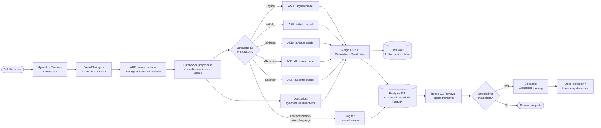

# Process Flow — From Recorded Call to Reviewed Transcript

This document walks through what happens to a single call recording as it moves through the architecture described in [Technical Architecture](03_technical_architecture.md), which itself formalizes `documents/Agent sales call review.drawio`.

## 1. Narrative Walkthrough

1. **Call recorded** — A sales agent's call is recorded by existing call-centre infrastructure and saved as an audio file (WAV/MP3/M4A).
2. **Uploaded to Firebase** — At the next scheduled batch window, the recording (plus metadata: agent ID, call timestamp, call ID) is uploaded to Firebase, which triggers FastAPI (US-1.1).
3. **Orchestration** — FastAPI hands off to Azure Data Factory, which moves the audio into the Storage account (Azure Blob) and the Datalake (ADLS Gen2).
4. **Preprocessing** — A Databricks job (reading via ABFSS) normalizes the audio (sample rate, channel handling) so it matches what the ASR models expect (US-1.2).
5. **Language identification** — The normalized audio is run through `facebook/mms-lid-256` (Databricks) to detect which of the target languages (English, isiZulu, isiXhosa, Afrikaans, Sesotho) it's in, with a confidence score (US-1.3). Low-confidence or mixed-language calls are flagged.
6. **Parallel processing (Databricks, GPU)**:
   - **Transcription (ASR)** — The call is routed to the ASR model best suited to its detected language (default `facebook/mms-1b-all`, per [Model Selection](05_model_selection_huggingface.md)) and transcribed into timestamped text segments (US-2.1, US-2.3).
   - **Diarization** — In parallel, the same audio is run through `pyannote/speaker-diarization-3.1` to determine speaker turns (Agent vs. Customer) with timestamps (US-2.2).
7. **Merge** — The ASR transcript and diarization output are merged on their shared timeline into a single, speaker-labeled, timestamped transcript, written back to the Datalake (full artifact) via ABFSS.
8. **Store structured results** — FastAPI writes the merged transcript's structured record (text, speakers, timestamps, confidence, language, status) to Postgres DB so the React QA Review UI can query it (US-3.3).
9. **QA review** — A QA Reviewer opens the call in React, reads the diarized transcript (served via FastAPI from Postgres), and can jump to any point in the original audio for verification (US-3.1).
10. **Feedback loop (ongoing)** — Transcripts sampled for evaluation feed WER/DER tracking, visualized in Streamlit for the Data/ML team (US-2.4), informing future model/fine-tuning decisions in [Model Selection](05_model_selection_huggingface.md).

## 2. Process Flow Diagram

## 3. Failure & Edge-Case Handling

| Situation | Handling |
|---|---|
| Corrupt/unsupported audio file | Rejected at Firebase/FastAPI ingestion with a clear error (US-1.1); not passed to Azure Data Factory |
| Low-confidence language ID | Flagged in Postgres for manual review rather than forced through a mismatched model (Step 5) |
| Mixed-language call (code-switching) | Flagged rather than silently transcribed in one language only (US-1.3) |
| Databricks job failure (ASR/diarization) | Job retried; persistent failure surfaces as a "failed" status in Postgres, visible in React (US-3.3) |

## 4. Related Documents

- [Technical Architecture](03_technical_architecture.md) — the components this flow runs through
- [Model Selection](05_model_selection_huggingface.md) — which model is used at each language-routed ASR step
